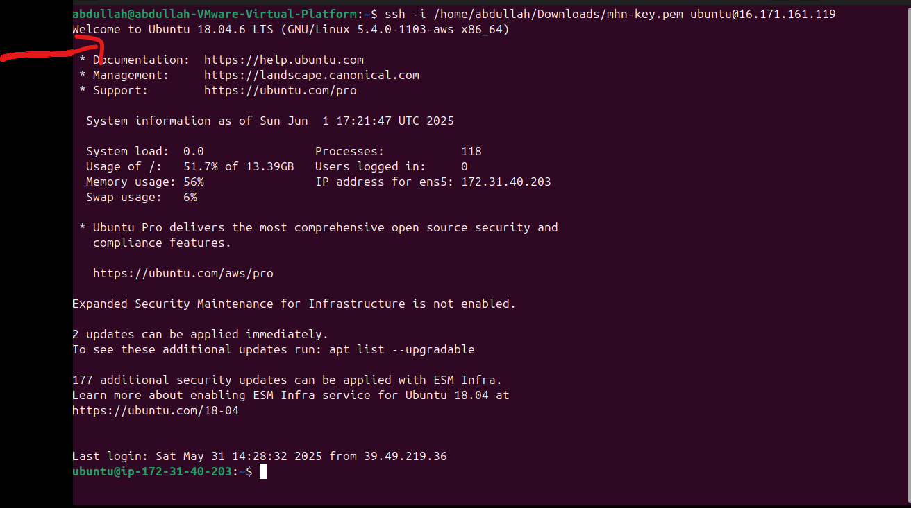

  

# Modern Honey Network (MHN) + Splunk Integration

**Threat Intelligence Honeypot Lab on AWS**

`HONEYPOT DEPLOYMENT · TROUBLESHOOTING · SIEM INTEGRATION · REAL-TIME VISUALIZATION`

---

### Author
**Muhammad Abdullah Siddiqui**

### Environment
AWS EC2 (Ubuntu 18.04) + Local VMware Workstation

### Stack
Modern Honey Network (MHN) · Dionaea · Splunk Enterprise

---

## Project Overview

This project demonstrates the deployment of **Modern Honey Network (MHN)** on AWS, configuration of the **Dionaea** honeypot, and integration with **Splunk Enterprise** for log collection, analysis, and visualization.

---

## 📂 Contents

1. [AWS Infrastructure Setup](#01-aws-infrastructure-setup)
2. [MHN Server Installation & Troubleshooting](#02-mhn-server-installation--troubleshooting)
3. [Dionaea Honeypot Deployment](#03-dionaea-honeypot-deployment)
4. [Splunk Enterprise Setup & Integration](#04-splunk-enterprise-setup--integration)
5. [Results & Visualizations](#05-results--visualizations)
6. [Recommendations](#06-recommendations)

---

## 01. AWS Infrastructure Setup

- Chose Ubuntu 18.04 LTS because newer versions are not compatible with MHN.
- Instance: 1 GB RAM, 15 GB disk space.
- Created SSH key pair for access from local VM.
- Configured Inbound & Outbound security rules.

---

## 02. MHN Server Installation & Troubleshooting

- Used Python 2.7 in virtual environment due to outdated MHN.
- Ran `install.sh`.
- Fixed missing supervisor configuration files.
- Resolved `mhn-collector` and `mhn-ui` spawn errors.
- Manually downloaded missing CSS files from GitHub.

**MHN UI Issues & Fix:**

---

## 03. Dionaea Honeypot Deployment

Deployed Dionaea using MHN deployment script. Successfully started capturing attacks.

**Real-time World Map:**

---

## 04. Splunk Enterprise Setup & Integration

- Installed Splunk Enterprise on local VM.
- Configured HTTP Event Collector (HEC) with token.
- Created `forward.py` script to send MHN logs to Splunk.

---

## 05. Results & Visualizations

**Splunk Search Results:**

---

## 06. Recommendations

> **⚠️ Important Note**

**I would recommend not to use MHN** since it is no longer supported. It is too much of a hassle due to outdated dependencies, missing files, and frequent issues. While it served as a good learning experience, please use modern alternatives for future projects.

---

## Technologies Used

- **Cloud**: AWS EC2
- **OS**: Ubuntu 18.04 LTS
- **Honeypot**: Modern Honey Network (MHN) + Dionaea
- **SIEM**: Splunk Enterprise 9.4.2
- **Scripting**: Python 2.7, Bash

---

**Cyber Threat Intelligence Home Lab**  
*Successfully Deployed & Integrated*

